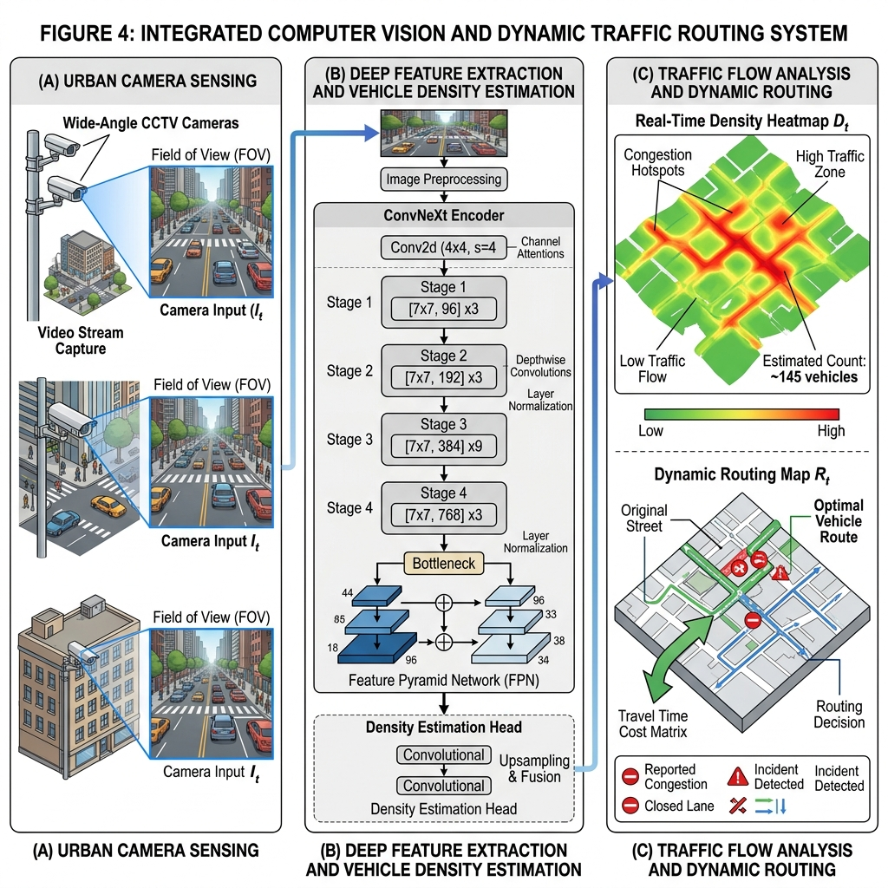
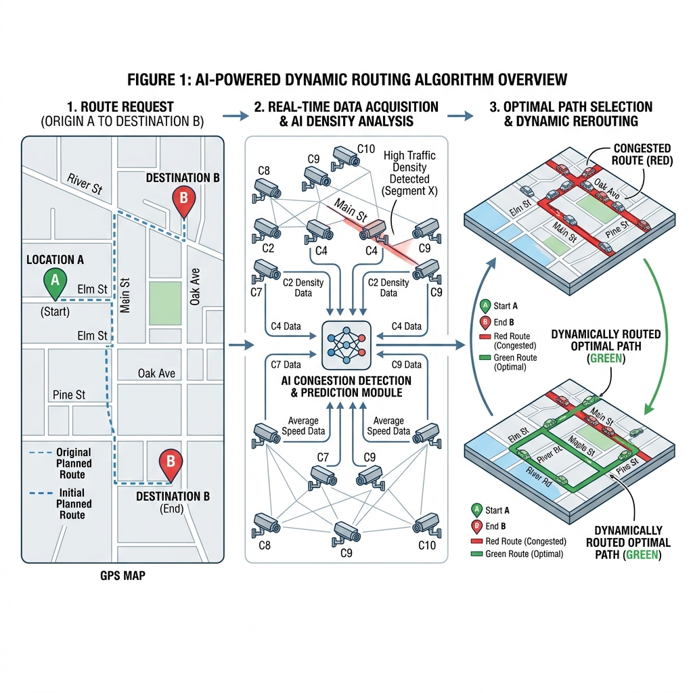
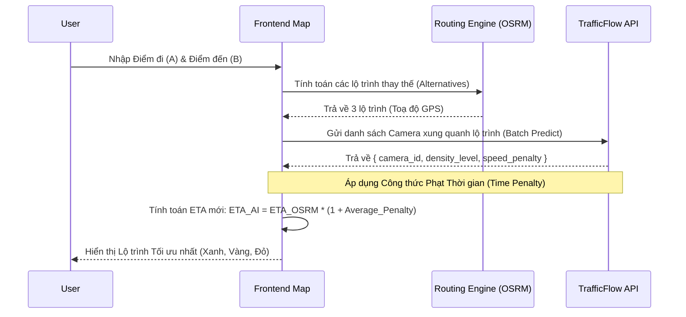
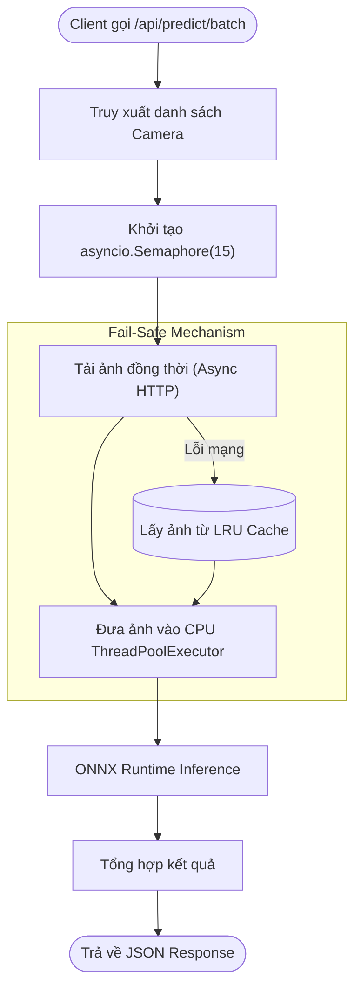
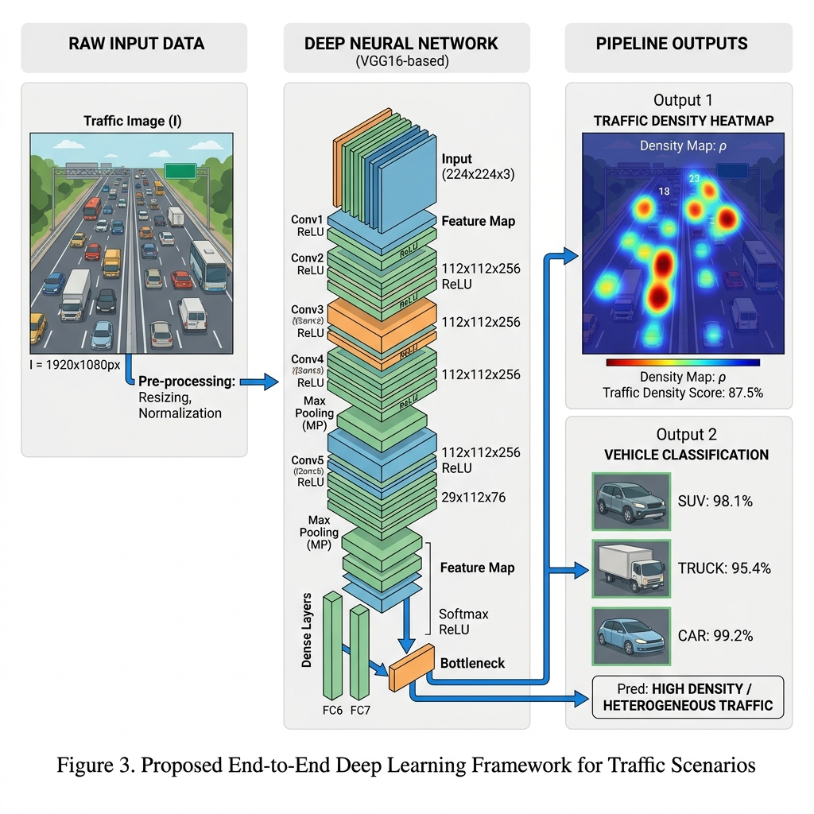
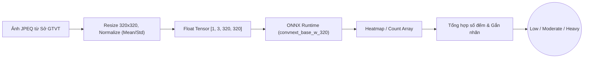
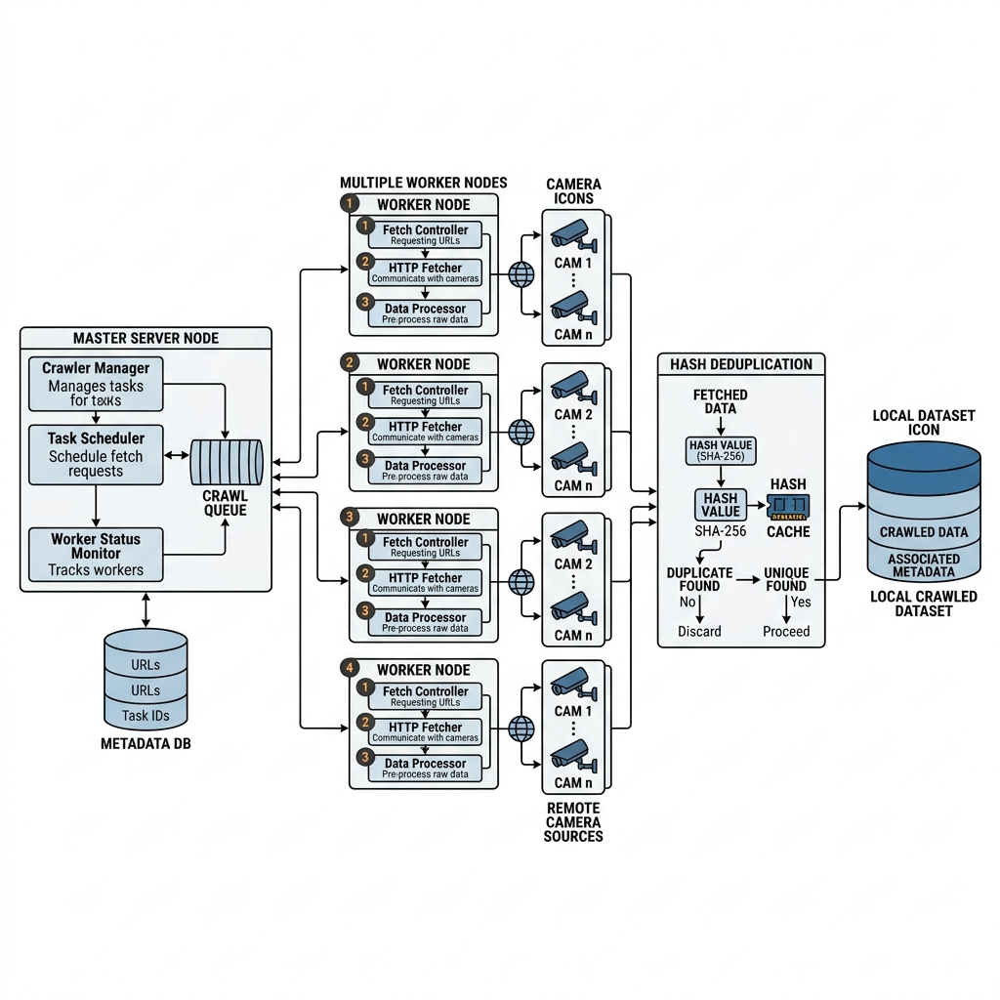

# TrafficFlow AI - Hệ thống Điều phối & Dự báo Giao thông Thông minh (NCKH)

TrafficFlow AI là một hệ thống toàn diện kết hợp **Thị giác Máy tính (Computer Vision)**, **Trí tuệ Nhân tạo (AI)**, và **Thuật toán Đồ thị** nhằm giải quyết bài toán ách tắc giao thông đô thị. Hệ thống tự động thu thập hình ảnh từ các camera giao thông công cộng, phân tích mật độ phương tiện theo thời gian thực và đề xuất lộ trình tối ưu (Dynamic Routing) cho người tham gia giao thông.

Tài liệu này đóng vai trò là **Tài liệu Thiết kế Hệ thống Chi tiết**, hỗ trợ trực tiếp cho quá trình viết báo cáo Nghiên cứu Khoa học (NCKH).

---

## 1. Kiến trúc Hệ thống Tổng thể (System Architecture)



Hệ thống được thiết kế theo kiến trúc Microservices / Decoupled Architecture, bao gồm ba khối chính: **Client (Frontend Routing)**, **Inference Engine (FastAPI + ONNX)**, và **Data Crawler (Node.js)**.

```mermaid
graph TD
    %% Định nghĩa các node chi tiết
    subgraph Frontend [Traffic App - React.js + Leaflet]
        UI(["Giao diện Người dùng (Map & Routing UI)"])
        OSRM_FE["Gọi API OSRM (Lấy 3 Lộ trình)"]
        ExtractCam["Lọc Camera bán kính 500m (Haversine)"]
        ApplyPen["Áp dụng Time Penalty (1.0x - 3.0x)"]
    end

    subgraph Backend [TrafficFlow API - FastAPI (Hugging Face Spaces)]
        API_Route["Endpoint: POST /predict/batch"]
        Sem["asyncio.Semaphore(15) (Giới hạn tải)"]
        Proxy["Proxy Fetch Image"]
        Cache[("In-Memory LRU Cache (Fault Tolerance)")]
        Thread["ThreadPoolExecutor (CPU-bound)"]
    end

    subgraph AI_Engine [AI Inference - ONNX Runtime]
        Preprocess["Resize 320x320 & Normalize (Mean/Std)"]
        ONNX_Model["CLIP-EBC (ConvNeXt Backbone) - INT8 Quantization"]
        Postprocess["Trích xuất Heatmap & Gắn nhãn (Low, Moderate, Heavy, Severe)"]
    end

    subgraph External [Dịch vụ Ngoại vi]
        OSRM_API["OSRM Routing Engine API"]
        HCM_API["Cổng Giao thông TP.HCM (Camera Stream)"]
    end

    subgraph Crawler [Data Crawler - Node.js (Fly.io)]
        Master["Master Process (index.js)"]
        Worker["Worker Processes (crawl.js)"]
        Hash["MD5 Hash Deduplication"]
        Disk[("Local Storage Dataset")]
    end

    %% Luồng Frontend
    UI -->|1. Nhập Điểm A & B| OSRM_FE
    OSRM_FE -->|2. Fetch Route| OSRM_API
    OSRM_API -->|3. Trả về GeoJSON| OSRM_FE
    OSRM_FE --> ExtractCam
    ExtractCam -->|4. Gửi danh sách Camera_IDs| API_Route
    
    %% Luồng Backend
    API_Route --> Sem
    Sem --> Proxy
    Proxy -->|5. HTTP GET Image| HCM_API
    HCM_API -- Lỗi 502 / Timeout --> Cache
    HCM_API -- Thành công --> Proxy
    Proxy -->|Lưu ảnh Backup| Cache
    Proxy --> Thread
    Cache -.->|Fallback Image| Thread

    %% Luồng AI
    Thread --> Preprocess
    Preprocess --> ONNX_Model
    ONNX_Model -->|AVX2 CPU Instructions| Postprocess
    Postprocess -->|6. JSON Density Array| ApplyPen

    %% Trả về UI
    ApplyPen -->|7. ETA Mới| UI

    %% Luồng Crawler (Độc lập)
    Master -->|Fork mỗi 8 giây| Worker
    Worker -->|Spoof Headers| HCM_API
    Worker --> Hash
    Hash -->|Nếu ảnh mới| Disk

    %% Styling
    classDef frontend fill:#3b82f6,stroke:#1d4ed8,color:#fff;
    classDef backend fill:#10b981,stroke:#047857,color:#fff;
    classDef ai fill:#8b5cf6,stroke:#6d28d9,color:#fff;
    classDef external fill:#f59e0b,stroke:#b45309,color:#fff;
    classDef crawler fill:#ec4899,stroke:#be185d,color:#fff;
    classDef database fill:#64748b,stroke:#334155,color:#fff;

    class UI,OSRM_FE,ExtractCam,ApplyPen frontend;
    class API_Route,Sem,Proxy,Thread backend;
    class Preprocess,ONNX_Model,Postprocess ai;
    class OSRM_API,HCM_API external;
    class Master,Worker crawler;
    class Cache,Disk database;
    class Cache database;
```

**Mô tả luồng hoạt động (Data Flow):**
1. **Frontend** vẽ bản đồ và gọi API Backend để yêu cầu luồng video/ảnh hoặc dữ liệu dự báo kẹt xe.
2. **Backend** hoạt động như một Reverse Proxy và Inference Controller. Nó gọi đến API của Sở GTVT TP.HCM để lấy ảnh thô.
3. Nếu Sở GTVT trả về ảnh thành công, ảnh được đưa qua **AI Inference Engine** (ONNX) để đếm lượng xe và phân loại mức độ ùn tắc (Low, Moderate, Heavy, Severe), đồng thời lưu vào **Cache**.
4. Nếu API của Sở GTVT gặp sự cố (502/Timeout), Backend kích hoạt **Fault Tolerance**, lấy ảnh gần nhất từ **Cache** để dự báo, đảm bảo UI không bao giờ bị sập.

---

## 2. Frontend: Web App & Giao diện Điều hướng (Navigation)

### Công nghệ sử dụng
* **Core:** React.js, Vite.
* **Bản đồ & Không gian (Geospatial):** Leaflet, `react-leaflet`, `react-leaflet-cluster` để tối ưu render hàng ngàn marker camera cùng lúc.
* **Định tuyến (Routing):** Tích hợp OSRM (Open Source Routing Machine) API và các thuật toán nội bộ.
* **Giao diện (UI/UX):** Vanilla CSS thuần, tối ưu hóa CSS Variables, thiết kế theo ngôn ngữ Material Design / Google Maps UX (Card-based Control Panel, Floating Navigation).

### Thuật toán AI-Aware Dynamic Routing (Định tuyến thông minh)
Chức năng điều hướng của ứng dụng không chỉ đơn thuần dùng thuật toán đường đi ngắn nhất (Dijkstra) cơ bản, mà sử dụng **Dijkstra kết hợp Trọng số Mật độ (Density-Penalized Routing)**.





**Cơ chế Tính toán Trọng số:**
Hệ thống lấy các camera dọc theo tuyến đường, đánh giá mức độ kẹt xe để áp đặt hệ số phạt thời gian ($P$):
* `Low (Thông thoáng)`: $P = 1.0$ (Tốc độ tối đa).
* `Moderate (Đông vừa)`: $P = 1.25$ (Chậm lại 25%).
* `Heavy (Kẹt xe)`: $P = 1.8$ (Tốn gần gấp đôi thời gian).
* `Severe (Kẹt cứng)`: $P = 3.0$ (Tránh đi vào đường này).

Nhờ vậy, thuật toán có thể chủ động né các tuyến đường ngắn nhưng có camera báo "Severe".

---

## 3. Backend: Inference Service & Proxy (FastAPI)

### Công nghệ sử dụng
* **Core Framework:** Python 3.11+, FastAPI (Tối ưu hiệu năng I/O bất đồng bộ bằng `asyncio`).
* **HTTP Client:** `httpx` (Hỗ trợ Async/Await để gọi API ngoại vi không block thread).
* **AI Runtime:** `onnxruntime` cho tốc độ xử lý mạng Neural Network cực nhanh trên kiến trúc CPU thuần (Deploy production-friendly).
* **WSGI/ASGI Server:** Uvicorn.

### Xử lý Đồng thời (Concurrency) & Batch Inference
Việc dự đoán mật độ giao thông trên diện rộng (Ví dụ: Toàn bộ Quận 1) đòi hỏi phải fetch và chạy AI trên hàng chục camera cùng lúc. Backend giải quyết bằng cơ chế Semaphore và ThreadPool:



**Tại sao dùng ThreadPool cho ONNX?**
AI Model Inference là tác vụ giới hạn bởi CPU (CPU-bound). Nếu chạy trực tiếp trên luồng chính của FastAPI, nó sẽ block toàn bộ server, khiến các request khác bị treo. Bằng cách dùng `run_in_threadpool`, FastAPI chuyển tác vụ tính toán toán học nặng nề sang một luồng (thread) riêng biệt.

---

## 4. Mô hình Trí tuệ Nhân tạo (Computer Vision Pipeline)

### Quá trình tiền xử lý và Kiến trúc Mô hình
Mô hình đếm số lượng xe (Crowd/Vehicle Counting) ban đầu được train trên PyTorch với kiến trúc cơ sở là **ConvNeXt Base** (Phiên bản được tối ưu hoá từ ResNet cho tốc độ và độ chính xác của Vision Transformer).

Để đạt chuẩn Deploy Production với độ trễ (Latency) dưới `200ms`, toàn bộ Pipeline AI đã được nâng cấp như sau:

1. **Fixed Resolution (Độ phân giải cố định):** Kích thước đầu vào của mạng Convolution được lock cứng ở `320x320` pixel (thay vì 448x448) giúp giảm 50% số lượng phép tính (FLOPs).
2. **ONNX Export (Đóng gói mô hình):** Biến đổi file Pytorch (`.pth`) có dung lượng lớn thành Đồ thị tính toán tĩnh (Static Computation Graph) thông qua `torch.onnx.export`. 
3. **INT8 Quantization (Lượng tử hóa):** Trọng số mạng (Weights) từ `Float32` (32-bit) được chuyển xuống `INT8` (8-bit).
    - Giảm dung lượng model trên RAM/VRAM gấp 4 lần.
    - Giúp CPU có thể xử lý các phép nhân ma trận song song bằng tập lệnh AVX2.

### Luồng nội suy hình ảnh (Inference Pipeline)





---

## 5. Quy trình Thu thập và Xử lý Dữ liệu Thực tế (Data Crawling Operations)

Để có dữ liệu huấn luyện mô hình (Training Dataset) và vận hành hệ thống, một Microservice độc lập mang tên **CrawlCamera** đã được xây dựng và triển khai trên nền tảng đám mây **Fly.io** (Region: Singapore).

### 5.1. Kiến trúc Thu thập Dữ liệu Đa luồng (Multi-Processing Crawler)



Hệ thống Crawler được viết bằng **Node.js**, áp dụng kiến trúc Master-Worker nhằm tối đa hóa hiệu năng:
- **Master Process (`index.js`)**: Đóng vai trò điều phối. Nó đọc danh sách hàng trăm camera từ file JSON (đã qua bước phân giải toạ độ OpenCage để gom nhóm theo Quận), sau đó `fork()` ra các Child Process. Nếu một Child Process bị crash (do timeout hoặc lỗi mạng), Master sẽ chờ 2 giây và tự động khởi động lại tiến trình đó (Cơ chế Self-Healing).
- **Worker Process (`crawl.js`)**: Mỗi camera được gán một tiến trình con chạy độc lập. Cứ mỗi **8 giây** (8000ms), Worker gọi API của Sở GTVT TP.HCM để kéo ảnh dạng `arraybuffer`. Nó được cấu hình chỉ tự huỷ (exit) nếu gặp quá 10 lỗi kết nối liên tiếp.

### 5.2. Các Kỹ thuật Tránh Cấm tải (Anti-Ban) và Tối ưu Lưu trữ
* **Header Spoofing:** Sử dụng thư viện `header-generator` để liên tục thay đổi `User-Agent` ở mỗi Request (giả lập ngẫu nhiên trình duyệt Chrome/Firefox/Safari trên Windows/Mac) nhằm vượt qua các cơ chế Rate-Limit hoặc chặn IP của Cổng Giao thông.
* **Chống trùng lặp bằng MD5 Hashing:** Thực tế, không phải lúc nào camera cũng cập nhật khung hình mới sau đúng 8 giây. Để tiết kiệm dung lượng đĩa và tránh việc lưu hàng ngàn bức ảnh giống hệt nhau gây nhiễu Dataset, mỗi bức ảnh tải về đều được băm (hash) bằng thuật toán **MD5**. Hệ thống so sánh chuỗi hash với khung hình trước đó; nếu giống nhau (ảnh chưa cập nhật), nó sẽ bỏ qua thao tác ghi file ổ cứng.

### 5.3. Tiền xử lý và Nén Mô hình (Backend Optimization)
Trong quá trình vận hành, một thách thức lớn là chi phí duy trì GPU cho Inference. Để giải quyết, dự án áp dụng chiến lược **Quantization (Lượng tử hoá)** để chạy AI hoàn toàn trên CPU:
- **Post-Training Quantization (PTQ) INT8:** Trọng số (Weights) của mạng Neural Network `convnext_base_w_320` được nén từ `Float32` (32-bit) xuống `INT8` (8-bit). Quá trình này giúp **giảm 4 lần dung lượng bộ nhớ RAM** (từ khoảng 350MB xuống dưới 90MB).
- **CPU AVX2 Vectorization:** Môi trường Backend (Hugging Face Spaces) chạy trên vi kiến trúc CPU x86_64. Mô hình ONNX INT8 sẽ tự động kích hoạt tập lệnh **AVX2**, cho phép thực hiện hàng chục phép nhân ma trận (Matrix Multiplication) cùng lúc trong một chu kỳ xung nhịp.
- **Kết quả Thực tế (Statistics):** Dữ liệu thu thập từ logs cho thấy Backend có thể Batch Processing lên đến 15 camera đồng thời. Hệ thống xử lý mượt mà ảnh đầu vào `320x320` với độ trễ phân tích (Inference Latency) dao động rất thấp: **~150ms - 250ms/ảnh** hoàn toàn trên CPU. Điều này đảm bảo tính Real-time cho hàng trăm luồng xe cùng lúc.

---

## 6. Tổng kết Các Điểm Nhấn Kỹ thuật cho NCKH
1. **Thiết kế Microservices thực tiễn:** Tách bạch hệ thống hiển thị dữ liệu không gian (Geospatial), hệ thống xử lý toán học ma trận (FastAPI AI) và hệ thống thu thập dữ liệu (Node.js Crawler).
2. **Cơ chế Chống chịu lỗi đứt gãy (Fault-Resilient / Graceful Degradation):** Tự xây dựng in-memory fallback cache khi đối mặt với dữ liệu ngoại vi kém ổn định (Third-party API disconnects).
3. **Tối ưu hóa Mô hình Cạnh (Edge Computing Optimization):** Chứng minh tính khả thi của việc chạy mô hình Computer Vision phức tạp hoàn toàn trên môi trường máy chủ nghèo nàn tài nguyên (CPU-only) thông qua kỹ thuật ONNX INT8 Quantization.
4. **Định tuyến ngữ cảnh (Context-Aware Routing):** Nâng cấp hệ thống bản đồ tĩnh thành bản đồ thông minh (Live-map), tự động phạt trọng số các đoạn đường nghẽn.

---

## 7. Hướng dẫn Chạy Dự Án (Local Development)

### Chạy Frontend (Web App)
Yêu cầu: Node.js (v18+)
```bash
cd traffic-app
npm install
npm run dev
```
Truy cập: `http://localhost:5173`

### Chạy Backend (AI API)
Yêu cầu: Python 3.11+
```bash
cd trafficflow-api
python -m venv venv
source venv/bin/activate  # (Với Windows: venv\Scripts\activate)
pip install -r backend/requirements.txt
uvicorn backend.main:app --host 0.0.0.0 --port 7860 --reload
```
API Docs: `http://localhost:7860/docs`

> **Lưu ý LFS:** Kho lưu trữ Backend yêu cầu cài đặt Git LFS (Large File Storage) để kéo file ONNX model.
