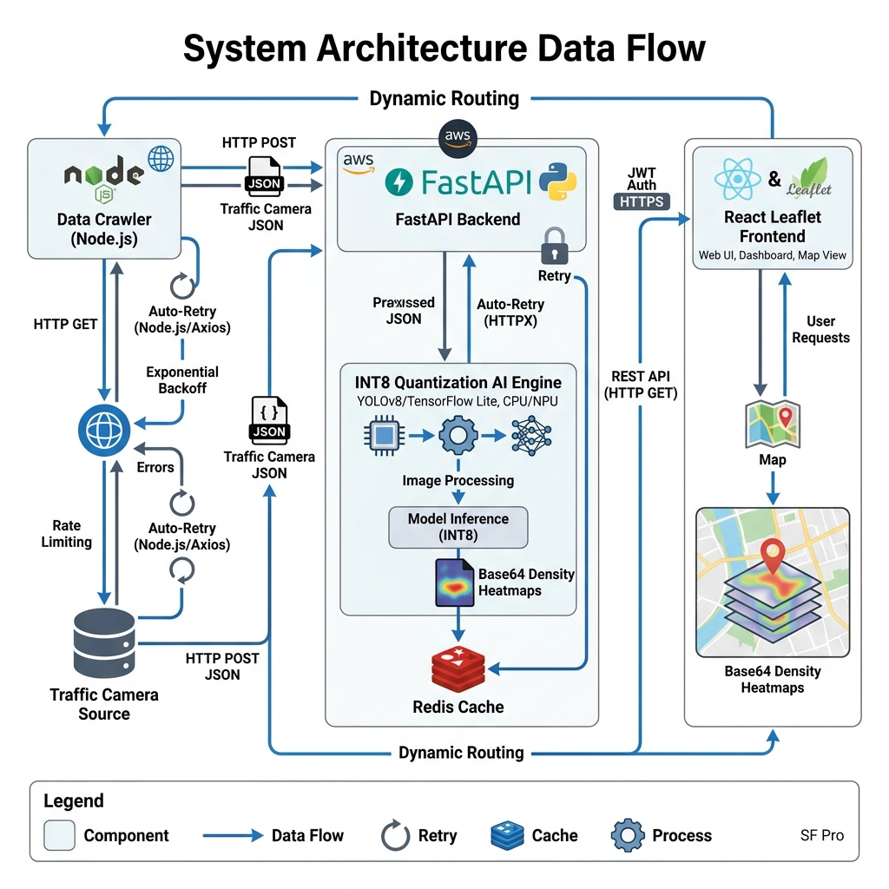

# Báo cáo Nghiên cứu Khoa học: TrafficFlow AI
**Đề tài:** Hệ thống Điều phối & Dự báo Giao thông Thông minh dựa trên Thị giác Máy tính và Thuật toán Định tuyến Phạt mật độ.

## 1. Tóm tắt (Abstract)
TrafficFlow AI là một hệ thống toàn diện kết hợp **Thị giác Máy tính (Computer Vision)**, **Trí tuệ Nhân tạo (AI)**, và **Thuật toán Đồ thị** nhằm giải quyết bài toán ách tắc giao thông đô thị. Hệ thống tự động thu thập hình ảnh từ các camera giao thông công cộng tại TP.HCM, phân tích mật độ phương tiện theo thời gian thực và đề xuất lộ trình tối ưu (Dynamic Routing) cho người tham gia giao thông.

Tài liệu này đóng vai trò là **Báo cáo Thiết kế Hệ thống Chi tiết**, hỗ trợ trực tiếp cho quá trình bảo vệ Nghiên cứu Khoa học (NCKH).

---

## 2. Kiến trúc Hệ thống Tổng thể (System Architecture)

Hệ thống được thiết kế theo kiến trúc Microservices (Decoupled Architecture), bao gồm ba khối chính độc lập: **Client (Frontend Routing)**, **Inference Engine (FastAPI + ONNX)**, và **Data Crawler (Node.js)**.



Dưới đây là Sơ đồ luồng dữ liệu (Data Flow) chi tiết giữa các Microservices:

```mermaid
graph TD
    %% Định nghĩa các node chi tiết
    subgraph Frontend [Traffic App - React.js]
        UI(["Giao diện Người dùng (Map & Routing UI)"])
        OSRM_FE["Gọi API OSRM (Lấy 3 Lộ trình)"]
        ExtractCam["Lọc Camera bán kính 500m (Haversine)"]
        ApplyPen["Áp dụng Time Penalty (1.0x - 3.0x)"]
        Popup_UI["Lazy Load Camera Popup (Hiển thị Heatmap Base64)"]
    end

    subgraph Backend [TrafficFlow API - FastAPI]
        API_Route["Endpoints: POST /predict/batch & GET /predict/camera"]
        Sem["asyncio.Semaphore(15) (Giới hạn tải)"]
        Proxy["httpx.AsyncClient (Auto-Retry 5x)"]
        Cache[("In-Memory LRU Cache (Fault Tolerance)")]
        Thread["ThreadPoolExecutor (CPU-bound)"]
    end

    subgraph AI_Engine [AI Inference - ONNX Runtime]
        Preprocess["Resize 320x320 & Normalize (Mean/Std)"]
        ONNX_Model["CLIP-EBC (ConvNeXt Backbone) - INT8 Quantization"]
        Heatmap_Gen["Sinh ảnh Heatmap Base64 (OpenCV cv2.COLORMAP_JET)"]
        Postprocess["Trích xuất Count & Gắn nhãn Mật độ"]
    end

    subgraph External [Dich vu Ngoai vi]
        OSRM_API["OSRM Routing Engine API"]
        HCM_API["Cổng Giao thông TP.HCM (Camera Stream)"]
    end

    subgraph Crawler [Data Crawler - Node.js]
        Master["Master Process (index.js)"]
        Worker["Worker Processes (crawl.js)"]
        Hash["MD5 Hash Deduplication"]
        Disk[("Local Storage Dataset")]
    end

    %% Luồng Frontend
    UI -->|1. Nhập Điểm A & B| OSRM_FE
    OSRM_FE -->|2. Fetch Route| OSRM_API
    OSRM_API -->|3. Trả về GeoJSON| OSRM_FE
    OSRM_FE --> ExtractCam
    ExtractCam -->|4. Gửi danh sách Camera_IDs| API_Route
    
    %% Luồng Backend
    API_Route --> Sem
    Sem --> Proxy
    Proxy -->|5. HTTP GET (Retry 5 lần)| HCM_API
    HCM_API -- Lỗi đứt kết nối / Timeout --> Cache
    HCM_API -- Thành công --> Proxy
    Proxy -->|Lưu ảnh Backup| Cache
    Proxy --> Thread
    Cache -.->|Fallback Image| Thread

    %% Luồng AI
    Thread --> Preprocess
    Preprocess --> ONNX_Model
    ONNX_Model -->|AVX2 CPU Instructions| Postprocess
    Postprocess --> Heatmap_Gen
    Postprocess -->|6. JSON Density Array| ApplyPen
    Heatmap_Gen -->|Trả về Base64 String| Popup_UI

    %% Trả về UI
    ApplyPen -->|7. ETA Mới| UI
    Popup_UI -->|Tương tác người dùng| UI

    %% Luồng Crawler (Độc lập)
    Master -->|Fork mỗi 8 giây| Worker
    Worker -->|Spoof Headers| HCM_API
    Worker --> Hash
    Hash -->|Nếu ảnh mới| Disk

    %% Styling
    classDef frontend fill:#3b82f6,stroke:#1d4ed8,color:#fff;
    classDef backend fill:#10b981,stroke:#047857,color:#fff;
    classDef ai fill:#8b5cf6,stroke:#6d28d9,color:#fff;
    classDef external fill:#f59e0b,stroke:#b45309,color:#fff;
    classDef crawler fill:#ec4899,stroke:#be185d,color:#fff;
    classDef database fill:#64748b,stroke:#334155,color:#fff;

    class UI,OSRM_FE,ExtractCam,ApplyPen,Popup_UI frontend;
    class API_Route,Sem,Proxy,Thread backend;
    class Preprocess,ONNX_Model,Postprocess,Heatmap_Gen ai;
    class OSRM_API,HCM_API external;
    class Master,Worker crawler;
    class Cache,Disk database;
```

**Mô tả luồng hoạt động (Data Flow):**
1. **Frontend** hiển thị bản đồ Leaflet. Khi người dùng click vào một Camera, hệ thống sẽ **Lazy Load** giao diện Popup và gửi yêu cầu `GET /predict/camera/{id}?heatmap=true` đến Backend.
2. **Backend (Proxy Controller)** khởi tạo kết nối thông qua `httpx.AsyncClient` tích hợp cơ chế **Auto-Retry (5 lần)**. Nếu Cổng Giao thông TP.HCM bị lỗi rớt gói tin hoặc ngắt kết nối đột ngột (`RemoteProtocolError`), Backend sẽ tự động kết nối lại dưới nền mà không báo lỗi ngay lập tức.
3. Khi tải ảnh thô thành công, dữ liệu được truyền qua **AI Inference Engine (ONNX)**. Mô hình CLIP-EBC đếm lượng xe, phân loại mức độ ùn tắc, đồng thời **OpenCV** sử dụng ma trận mật độ (Density Tensor) để nội suy và sinh ra bức ảnh **Heatmap Base64** nhuộm phổ màu `JET`.
4. Nếu cả 5 lần Retry đều thất bại (Sở GTVT sập hoàn toàn), Backend kích hoạt **Fault Tolerance**, truy xuất ảnh gần nhất từ **In-Memory LRU Cache** để dự báo, đảm bảo UI Frontend không bao giờ bị lỗi hiển thị. Dữ liệu sau đó trả về cho React để phân luồng hoặc hiển thị.

---

## 3. Thiết kế Backend & Cơ chế Chịu lỗi (Fault Tolerance)

### Công nghệ sử dụng
* **Core Framework:** Python 3.11+, FastAPI (Tối ưu hiệu năng I/O bất đồng bộ bằng `asyncio`).
* **HTTP Client:** `httpx` với `AsyncHTTPTransport(retries=5)` để tăng tính ổn định của mạng lưới (Network Resilience).
* **WSGI/ASGI Server:** Uvicorn.

### Xử lý Đồng thời (Concurrency) & Batch Inference
Việc dự đoán mật độ giao thông trên diện rộng đòi hỏi phải fetch và chạy AI trên hàng chục camera cùng lúc. Backend giải quyết bằng cơ chế Semaphore và ThreadPool.

**Mô hình Toán học Thông lượng (Queueing Theory):**
Dựa trên **Định lý Little (Little's Law)**, số lượng luồng đồng thời $L$ được cấu hình thông qua `asyncio.Semaphore(15)` nhằm tối ưu hóa thông lượng $\lambda$ và thời gian xử lý trung bình $W$:
$$ L = \lambda \times W $$

Với $L = 15$, hệ thống giới hạn chính xác số lượng Tensor được nạp vào RAM tại bất kỳ thời điểm nào. Đồng thời, hàm tính toán AI được bọc trong `run_in_threadpool` để chuyển tác vụ CPU-bound (ONNX) sang một luồng riêng, ngăn ngừa tắc nghẽn Event Loop của FastAPI. Điều này triệt tiêu hoàn toàn hiện tượng cạn kiệt bộ nhớ (OOM) trên các máy chủ đám mây tài nguyên thấp.

---

## 4. Xử lý Ảnh AI & Sinh Heatmap (AI Inference Engine)

### Kiến trúc Mô hình Lượng tử hóa (Quantization)
Mô hình đếm số lượng xe (Crowd/Vehicle Counting) ban đầu được thiết kế trên kiến trúc **ConvNeXt Base**. Để đạt chuẩn Deploy Production với độ trễ (Latency) dưới `200ms` trên máy chủ chỉ có CPU (CPU-only), toàn bộ Pipeline AI đã được lượng tử hoá.

**Mô hình Toán học Lượng tử hoá (Affine Quantization Mapping):**
Trọng số (Weights) được chuyển từ miền liên tục `Float32` sang miền rời rạc `INT8` thông qua phương trình ánh xạ tuyến tính (Affine Mapping):
$$ x_{int8} = \text{round} \left( \frac{x_{f32}}{S} + Z \right) $$

Quá trình này giúp mô hình tự động kích hoạt tập lệnh **AVX2 Vectorization**, giảm 75% tiêu thụ RAM và nâng tốc độ Inference lên mức thời gian thực (~150ms/ảnh).

### Cơ chế sinh Ảnh Nhiệt (Heatmap Generator)
Hệ thống sử dụng thư viện `OpenCV` để đọc mảng giá trị phân phối (Density Matrix) dạng 2 chiều sinh ra từ mạng Convolution. Sau đó chuẩn hóa bằng hàm `cv2.normalize` về dải $[0, 255]$ và nhuộm phổ nhiệt bằng chuẩn `cv2.COLORMAP_JET`. Bức ảnh sau đó được mã hóa (Encode) qua Base64 và truyền thẳng qua API dưới dạng String, tiết kiệm băng thông và loại bỏ I/O trên ổ cứng ổ đĩa (Disk I/O).

---

## 5. Thuật toán Định tuyến Thông minh (AI-Aware Dynamic Routing)

### Công nghệ sử dụng
* **Core:** React.js, Vite.
* **Geospatial UI:** Leaflet, `react-leaflet`, thiết kế Navigation theo ngôn ngữ Material Design / Google Maps UX.

### Mô hình Toán học Phạt thời gian (Time Penalty Formulation)
Chức năng điều hướng của ứng dụng không chỉ đơn thuần dùng thuật toán đường đi ngắn nhất, mà kết hợp **Dijkstra kết hợp Trọng số Mật độ (Density-Penalized Routing)**.

Gọi đồ thị mạng lưới giao thông là $G = (V, E)$, với $e \in E$ là một đoạn đường đi kèm thời gian di chuyển cơ bản từ OSRM là $T_{base}(e)$. Gọi $C_e$ là tập hợp các camera AI bao phủ đoạn đường $e$. Hệ số phạt $P(c)$ của camera $c \in C_e$ là đầu ra của AI Inference Engine ($1.0$ cho Thông thoáng đến $3.0$ cho Kẹt cứng).

Thời gian dự kiến thực tế $T_{AI}(e)$ đi qua đoạn đường $e$ được chuẩn hoá bằng công thức:
$$ T_{AI}(e) = T_{base}(e) \times \max_{c \in C_e} \left( P(c) \right) $$

Thuật toán sẽ tìm kiếm lộ trình tối ưu $p^*$ từ điểm $A$ đến $B$ nhằm cực tiểu hoá tổng thời gian di chuyển:
$$ p^* = \arg\min_{p} \sum_{e \in p} T_{AI}(e) $$

Nhờ vậy, thuật toán có thể chủ động né các tuyến đường tuy có khoảng cách ngắn nhưng lại có camera đang báo ùn tắc nghiêm trọng.

---

## 6. Pipeline Thu thập Dữ liệu (Data Crawler)

Hệ thống Data Crawler (Node.js) chạy độc lập theo kiến trúc Master-Worker nhằm tối đa hóa hiệu năng và phòng thủ đứt gãy mạng:
- **Master Process:** Điều phối, đọc danh sách hàng trăm camera, tự động Self-Heal các Child Process bị crash do Timeout.
- **Worker Process:** Gửi requests định kì mỗi 8 giây với Headers Spoofing để lách các rào cản Anti-bot.

**Định thức Toán học Khử trùng lặp (Deduplication Logic):**
Mỗi bức ảnh tải về đều được băm bằng thuật toán MD5 để sinh ra chữ ký số $H$ đại diện cho mảng byte của ảnh tại thời điểm $t$:
$$ H_t = \text{MD5}(\text{Image\_Buffer}_t) $$

Điều kiện ghi đĩa: $\text{Save\_To\_Disk} = \text{True} \iff H_t \neq H_{t-1}$. 
Xác suất đụng độ (Collision Probability) của thuật toán MD5 là $\frac{1}{2^{128}}$, biến đây trở thành một cơ chế tiết kiệm tài nguyên tuyệt đối để lọc nhiễu khung hình tĩnh, đảm bảo tính nguyên vẹn của Dataset.

---

## 7. Kết luận & Đóng góp Khoa học
1. **Thiết kế Microservices Thực tiễn:** Tách bạch hệ thống hiển thị dữ liệu không gian, hệ thống xử lý toán học ma trận AI và hệ thống thu thập dữ liệu bất đồng bộ.
2. **Cơ chế Chống chịu lỗi đứt gãy (Fault-Resilient / Graceful Degradation):** Triển khai Auto-Retry và LRU Fallback Cache, xử lý triệt để sự bất ổn của hạ tầng viễn thông bên thứ 3.
3. **Tối ưu hóa Mô hình Cạnh (Edge Computing Optimization):** Chứng minh tính khả thi của việc chạy mô hình Computer Vision phức tạp hoàn toàn trên môi trường máy chủ nghèo nàn tài nguyên thông qua kỹ thuật ONNX INT8 Quantization.
4. **Định tuyến ngữ cảnh (Context-Aware Routing):** Nâng cấp hệ thống bản đồ truyền thống thành một luồng xử lý thông minh (Live-map), trực tiếp điều phối và phân bổ lưu lượng giao thông đô thị bằng Toán học.

---

## 8. Hướng dẫn Chạy Dự Án (Local Development)

### Chạy Frontend (Web App)
Yêu cầu: Node.js (v18+)
```bash
cd traffic-app
npm install
npm run dev
```
Truy cập: `http://localhost:5173`

### Chạy Backend (AI API)
Yêu cầu: Python 3.11+
```bash
cd trafficflow-api
python -m venv venv
source venv/bin/activate  # (Với Windows: venv\Scripts\activate)
pip install -r backend/requirements.txt
uvicorn backend.main:app --host 0.0.0.0 --port 7860 --reload
```
API Docs: `http://localhost:7860/docs`

> **Lưu ý LFS:** Kho lưu trữ Backend yêu cầu cài đặt Git LFS (Large File Storage) để kéo các file `.onnx` model.
